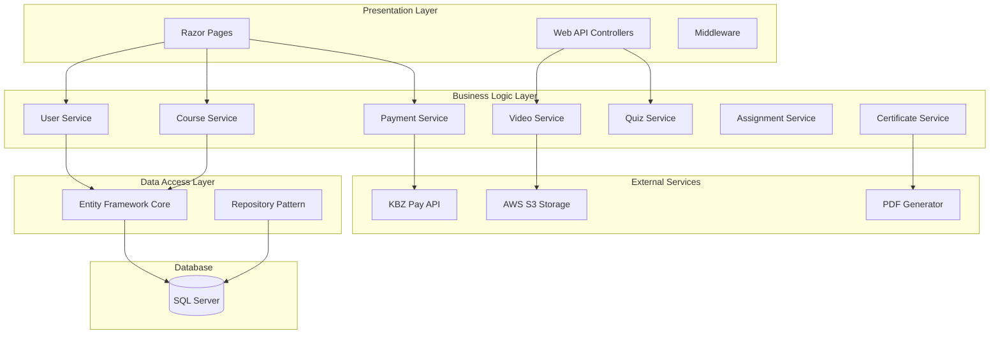

# Design Document

## Overview

The Learning Management System (LMS) is built using ASP.NET Core 8 with Razor Pages for the frontend, providing a comprehensive educational platform. The system supports multi-role authentication, course management, video streaming, quizzes, assignments, automatic certificate generation, and KBZ Pay integration for seamless payment processing.

The architecture follows clean architecture principles with clear separation between presentation (Razor Pages), business logic (Services), and data access (Entity Framework Core with SQL Server). The system integrates with AWS S3 for video storage and KBZ Pay API for payment processing.

## Architecture

### High-Level Architecture



### Technology Stack

- **Backend Framework**: ASP.NET Core 8
- **Frontend**: Razor Pages with Bootstrap 5
- **Database**: SQL Server with Entity Framework Core 8
- **Authentication**: ASP.NET Core Identity
- **Video Storage**: AWS S3
- **Payment Gateway**: KBZ Pay API
- **PDF Generation**: iTextSharp or QuestPDF
- **Client-side**: jQuery, AJAX for dynamic interactions
- **Localization**: ASP.NET Core Localization (English/Myanmar)

## Components and Interfaces

### Core Services

#### IUserService
```csharp
public interface IUserService
{
    Task<User> RegisterAsync(RegisterModel model);
    Task<SignInResult> LoginAsync(LoginModel model);
    Task<bool> ResetPasswordAsync(string email);
    Task<User> GetUserByIdAsync(int userId);
    Task<bool> ApproveStudentAsync(int userId);
}
```

#### ICourseService
```csharp
public interface ICourseService
{
    Task<IEnumerable<Course>> GetCoursesAsync(string language = "en");
    Task<Course> GetCourseByIdAsync(int courseId, string language = "en");
    Task<bool> EnrollStudentAsync(int userId, int courseId);
    Task<LessonProgress> UpdateLessonProgressAsync(int enrollmentId, int lessonId, bool completed, int? videoTimestamp = null);
    Task<bool> CanAccessLessonAsync(int userId, int lessonId);
}
```

#### IPaymentService
```csharp
public interface IPaymentService
{
    Task<string> InitiatePaymentAsync(int enrollmentId, decimal amount);
    Task<bool> ProcessPaymentCallbackAsync(KBZPaymentResponse response);
    Task<IEnumerable<Payment>> GetPaymentHistoryAsync(int userId);
    Task<bool> ValidatePaymentSignatureAsync(string signature, string payload);
}
```

#### IVideoService
```csharp
public interface IVideoService
{
    Task<string> GetSecureVideoUrlAsync(string videoKey, int userId);
    Task<bool> UploadVideoAsync(IFormFile video, string courseId);
    Task<bool> ValidateVideoAccessAsync(int userId, int lessonId);
}
```

### Data Models

#### Core Entities

**User Entity**
```csharp
public class User
{
    public int UserID { get; set; }
    public string Email { get; set; }
    public string PasswordHash { get; set; }
    public string FullName { get; set; }
    public UserRole Role { get; set; }
    public bool IsApprovedStudent { get; set; }
    public DateTime CreatedAt { get; set; }
    
    // Navigation Properties
    public ICollection<Enrollment> Enrollments { get; set; }
    public ICollection<Certificate> Certificates { get; set; }
}
```

**Course Entity**
```csharp
public class Course
{
    public int CourseID { get; set; }
    public string Title_EN { get; set; }
    public string Title_MM { get; set; }
    public string Description_EN { get; set; }
    public string Description_MM { get; set; }
    public decimal Price { get; set; }
    public DateTime CreatedAt { get; set; }
    
    // Navigation Properties
    public ICollection<Module> Modules { get; set; }
    public ICollection<Enrollment> Enrollments { get; set; }
}
```

**Lesson Entity**
```csharp
public class Lesson
{
    public int LessonID { get; set; }
    public int ModuleID { get; set; }
    public string Title_EN { get; set; }
    public string Title_MM { get; set; }
    public int LessonOrder { get; set; }
    public LessonType LessonType { get; set; }
    public string ContentURL { get; set; }
    
    // Navigation Properties
    public Module Module { get; set; }
    public ICollection<LessonProgress> LessonProgresses { get; set; }
    public Quiz Quiz { get; set; }
    public Assignment Assignment { get; set; }
}
```

### Payment Integration Models

**KBZ Pay Request Model**
```csharp
public class KBZPaymentRequest
{
    public string MerchantId { get; set; }
    public string OrderId { get; set; }
    public decimal Amount { get; set; }
    public string Currency { get; set; } = "MMK";
    public string ReturnUrl { get; set; }
    public string NotifyUrl { get; set; }
    public string Signature { get; set; }
}
```

**KBZ Pay Response Model**
```csharp
public class KBZPaymentResponse
{
    public string OrderId { get; set; }
    public string TransactionId { get; set; }
    public string Status { get; set; }
    public decimal Amount { get; set; }
    public string Signature { get; set; }
    public DateTime TransactionDate { get; set; }
}
```

## Data Models

### Database Schema Implementation

The system uses Entity Framework Core with the following DbContext configuration:

```csharp
public class LMSDbContext : DbContext
{
    public DbSet<User> Users { get; set; }
    public DbSet<Course> Courses { get; set; }
    public DbSet<Module> Modules { get; set; }
    public DbSet<Lesson> Lessons { get; set; }
    public DbSet<Enrollment> Enrollments { get; set; }
    public DbSet<Payment> Payments { get; set; }
    public DbSet<LessonProgress> LessonProgresses { get; set; }
    public DbSet<Quiz> Quizzes { get; set; }
    public DbSet<Question> Questions { get; set; }
    public DbSet<AnswerChoice> AnswerChoices { get; set; }
    public DbSet<QuizAttempt> QuizAttempts { get; set; }
    public DbSet<Assignment> Assignments { get; set; }
    public DbSet<AssignmentSubmission> AssignmentSubmissions { get; set; }
    public DbSet<Certificate> Certificates { get; set; }
}
```

### Relationships and Constraints

- **User → Enrollment**: One-to-Many (A user can enroll in multiple courses)
- **Course → Module**: One-to-Many (A course contains multiple modules)
- **Module → Lesson**: One-to-Many (A module contains multiple lessons)
- **Lesson → Quiz**: One-to-One (Optional - A lesson may have one quiz)
- **Lesson → Assignment**: One-to-One (Optional - A lesson may have one assignment)
- **Enrollment → Payment**: One-to-Many (An enrollment may have multiple payment attempts)
- **User → Certificate**: One-to-Many (A user can earn multiple certificates)

## Correctness Properties

*A property is a characteristic or behavior that should hold true across all valid executions of a system-essentially, a formal statement about what the system should do. Properties serve as the bridge between human-readable specifications and machine-verifiable correctness guarantees.*

### Property Reflection

After analyzing all acceptance criteria, several properties can be consolidated to eliminate redundancy:

- **Serialization properties (15.1, 15.2)** can be combined into a single round-trip property
- **Video access and lesson access properties (4.4, 13.1, 13.3)** can be consolidated into comprehensive access control properties
- **Payment processing properties (9.2, 9.5)** can be combined into automatic enrollment property
- **Dashboard display properties (2.1, 2.2)** can be consolidated into comprehensive dashboard property

### Core Properties

**Property 1: User registration creates valid accounts**
*For any* valid registration data, creating a new user account should result in a user with Student role and proper authentication credentials
**Validates: Requirements 1.1**

**Property 2: Authentication grants role-based access**
*For any* valid user credentials, successful authentication should grant access permissions that match the user's role and approval status
**Validates: Requirements 1.2, 1.5**

**Property 3: Password reset generates secure links**
*For any* registered user email, requesting password reset should generate a unique, time-limited reset token
**Validates: Requirements 1.3**

**Property 4: Session termination on logout**
*For any* authenticated user session, performing logout should invalidate the session and prevent further access
**Validates: Requirements 1.4**

**Property 5: Dashboard displays enrollment progress**
*For any* approved student with enrollments, accessing the dashboard should display all enrolled courses with accurate progress percentages
**Validates: Requirements 2.1, 2.2**

**Property 6: Resume learning navigation**
*For any* approved student with lesson progress, clicking resume learning should navigate to the most recently accessed incomplete lesson
**Validates: Requirements 2.3**

**Property 7: Certificate display after completion**
*For any* approved student who completes all course requirements, their dashboard should display the earned certificate
**Validates: Requirements 2.4**

**Property 8: Guest course preview access**
*For any* guest user, viewing course information should display titles, descriptions, and structure without granting access to full lesson content
**Validates: Requirements 3.1, 3.2, 3.4**

**Property 9: Guest content access prevention**
*For any* guest user attempting to access full lesson content, the system should prevent access and prompt for registration
**Validates: Requirements 3.3**

**Property 10: Sequential module and lesson ordering**
*For any* course with multiple modules and lessons, they should be displayed in the correct sequential order based on their order values
**Validates: Requirements 4.1, 4.2**

**Property 11: Lesson completion unlocks next lesson**
*For any* approved student completing a lesson, the next lesson in sequence should become accessible
**Validates: Requirements 4.3**

**Property 12: Prerequisite enforcement for lesson access**
*For any* lesson with prerequisites, access should only be granted when all previous lessons in the module are completed
**Validates: Requirements 4.4, 13.3**

**Property 13: Content type support**
*For any* lesson content (video, text, file), the system should render and provide access to the content in the appropriate format
**Validates: Requirements 4.5, 4.6**

**Property 14: Video streaming and progress tracking**
*For any* video lesson, the system should stream from AWS S3 and track viewing progress including timestamps for resume functionality
**Validates: Requirements 5.1, 5.3, 5.4**

**Property 15: Automatic lesson completion**
*For any* video lesson that is watched to completion, the system should automatically mark the lesson as complete and update course progress
**Validates: Requirements 5.2, 5.5**

**Property 16: Quiz creation and storage**
*For any* quiz created by an admin, all questions and correct answers should be stored accurately in the database
**Validates: Requirements 6.1**

**Property 17: Quiz taking and scoring**
*For any* quiz attempt by an approved student, the system should present questions, capture answers, and calculate scores automatically
**Validates: Requirements 6.2, 6.3**

**Property 18: Quiz pass/fail determination**
*For any* completed quiz, the system should determine pass or fail status based on the scoring criteria
**Validates: Requirements 6.4**

**Property 19: Required quiz progression blocking**
*For any* quiz marked as required, students must pass it before accessing the next module
**Validates: Requirements 6.5**

**Property 20: Assignment submission and review**
*For any* assignment file uploaded by an approved student, it should be stored with pending status and be available for admin review
**Validates: Requirements 7.1, 7.2, 7.4**

**Property 21: Certificate generation and content**
*For any* approved student completing all course requirements, a PDF certificate should be generated containing student name, course name, completion date, and unique certificate ID
**Validates: Requirements 8.1, 8.2, 8.4**

**Property 22: Certificate access and download**
*For any* generated certificate, the student should be able to access, download, and print it from their dashboard
**Validates: Requirements 8.3**

**Property 23: KBZ Pay integration and redirection**
*For any* course enrollment initiation, the system should redirect to KBZ Pay API with proper authentication and payment details
**Validates: Requirements 9.1, 14.1**

**Property 24: Automatic enrollment on payment success**
*For any* successful KBZ Pay transaction, the system should automatically approve enrollment and unlock course access without admin intervention
**Validates: Requirements 9.2, 9.5**

**Property 25: Payment failure handling**
*For any* failed payment transaction, the system should display appropriate error messages and maintain enrollment status as pending
**Validates: Requirements 9.3**

**Property 26: Payment signature validation**
*For any* payment response or webhook from KBZ Pay, the system should validate signatures to ensure authenticity before processing
**Validates: Requirements 14.2, 14.3**

**Property 27: KBZ Pay error handling**
*For any* KBZ Pay API unavailability or error, the system should handle errors gracefully and notify users appropriately
**Validates: Requirements 14.4**

**Property 28: Admin management capabilities**
*For any* admin user, the system should provide complete CRUD operations for users, courses, modules, lessons, quizzes, and assignments
**Validates: Requirements 10.1, 10.2, 10.3, 10.4, 10.5**

**Property 29: Multi-language content support**
*For any* course content or interface element, both English and Myanmar versions should be stored and displayed based on user language preference
**Validates: Requirements 11.2, 11.3, 11.4**

**Property 30: Video access authorization**
*For any* video content request, the system should verify user enrollment and approval status before granting access
**Validates: Requirements 13.1**

**Property 31: API authentication and authorization**
*For any* API request, the system should authenticate the user and authorize access based on their role and permissions
**Validates: Requirements 13.2**

**Property 32: Security event logging**
*For any* sensitive operation (login, payment, content access), the system should log security events for audit purposes
**Validates: Requirements 13.5**

**Property 33: Course data serialization round trip**
*For any* valid course object, serializing to JSON then deserializing should produce an equivalent course object
**Validates: Requirements 15.1, 15.2**

**Property 34: Input validation for course creation**
*For any* course creation input, the system should validate data against the course schema and reject invalid inputs
**Validates: Requirements 15.3**

**Property 35: Course export formatting**
*For any* course export operation, the system should generate properly formatted JSON suitable for backup and import purposes
**Validates: Requirements 15.4**

## Error Handling

### Exception Handling Strategy

The system implements comprehensive error handling across all layers:

**Presentation Layer (Razor Pages)**
- Global exception handling middleware
- Model validation with user-friendly error messages
- AJAX error handling for dynamic operations
- Graceful degradation for JavaScript failures

**Business Logic Layer (Services)**
- Custom exception types for domain-specific errors
- Validation exceptions for business rule violations
- External service exceptions for API failures
- Logging of all exceptions with context

**Data Access Layer (Entity Framework)**
- Database connection failure handling
- Constraint violation handling
- Transaction rollback on errors
- Optimistic concurrency conflict resolution

### Specific Error Scenarios

**Authentication Errors**
- Invalid credentials: Clear error message without revealing user existence
- Account lockout: Temporary lockout after failed attempts
- Session expiration: Automatic redirect to login with return URL

**Payment Processing Errors**
- KBZ Pay API failures: Retry mechanism with exponential backoff
- Network timeouts: User notification with retry options
- Invalid payment responses: Signature validation failures logged as security events

**Content Access Errors**
- Unauthorized access: Redirect to appropriate authentication/enrollment page
- Missing content: Graceful fallback with user notification
- AWS S3 failures: Cached content serving when possible

**File Upload Errors**
- File size limits: Clear messaging about maximum file sizes
- Invalid file types: Validation with supported format listing
- Storage failures: Retry mechanism with user notification

## Testing Strategy

### Dual Testing Approach

The system requires both unit testing and property-based testing to ensure comprehensive coverage:

**Unit Testing Requirements:**
- Unit tests verify specific examples, edge cases, and error conditions
- Integration tests verify component interactions
- Unit tests cover concrete scenarios and boundary conditions
- Focus on specific business logic implementations

**Property-Based Testing Requirements:**
- Property tests verify universal properties across all valid inputs
- Each correctness property must be implemented as a single property-based test
- Minimum 100 iterations per property test for thorough coverage
- Property tests tagged with format: **Feature: lms-platform, Property {number}: {property_text}**

### Testing Framework Selection

**Property-Based Testing Library:** FsCheck for .NET
- Mature library with excellent C# integration
- Supports custom generators for domain objects
- Configurable test iterations and shrinking
- Integration with xUnit test framework

**Unit Testing Framework:** xUnit with FluentAssertions
- Standard .NET testing framework
- Clear assertion syntax with FluentAssertions
- Excellent Visual Studio and CI/CD integration
- Comprehensive mocking support with Moq

### Test Configuration

**Property-Based Test Configuration:**
```csharp
[Property(MaxTest = 100)]
public Property PropertyName(/* parameters */)
{
    // Property implementation
}
```

**Test Organization:**
- Unit tests: `Tests/Unit/` directory structure
- Property tests: `Tests/Properties/` directory structure
- Integration tests: `Tests/Integration/` directory structure
- Test utilities and generators: `Tests/Generators/` directory

### Coverage Requirements

**Unit Test Coverage:**
- All service methods with specific examples
- Error handling scenarios
- Edge cases (empty collections, null values, boundary conditions)
- Integration points between components

**Property Test Coverage:**
- Each of the 35 correctness properties implemented as separate tests
- Custom generators for User, Course, Lesson, Quiz, and Payment objects
- Comprehensive input space coverage through intelligent generators
- Round-trip properties for serialization and data persistence